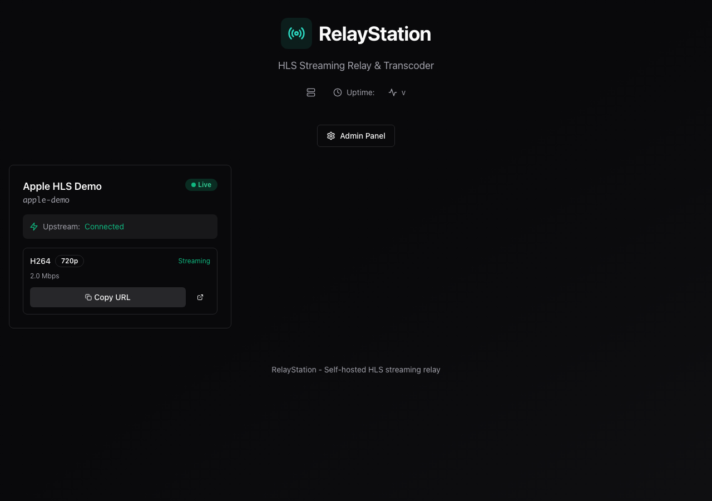
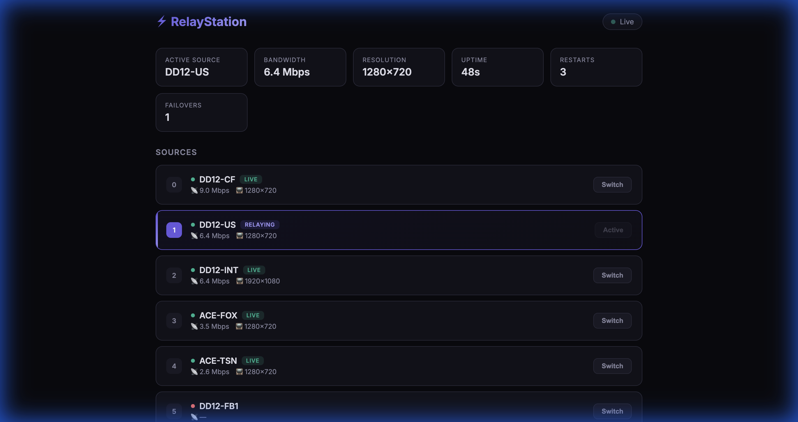
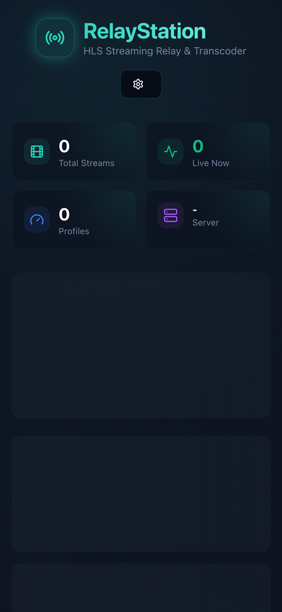
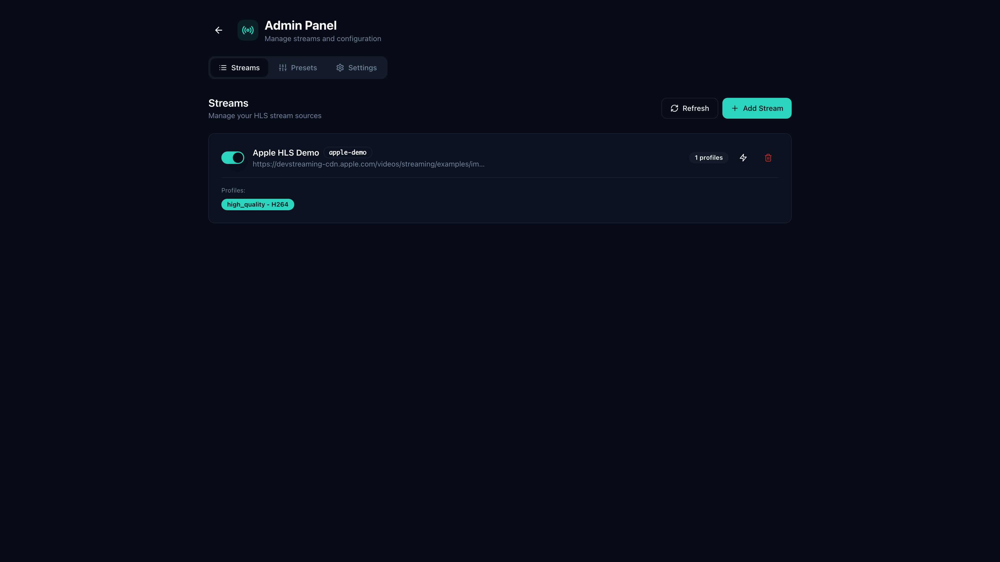
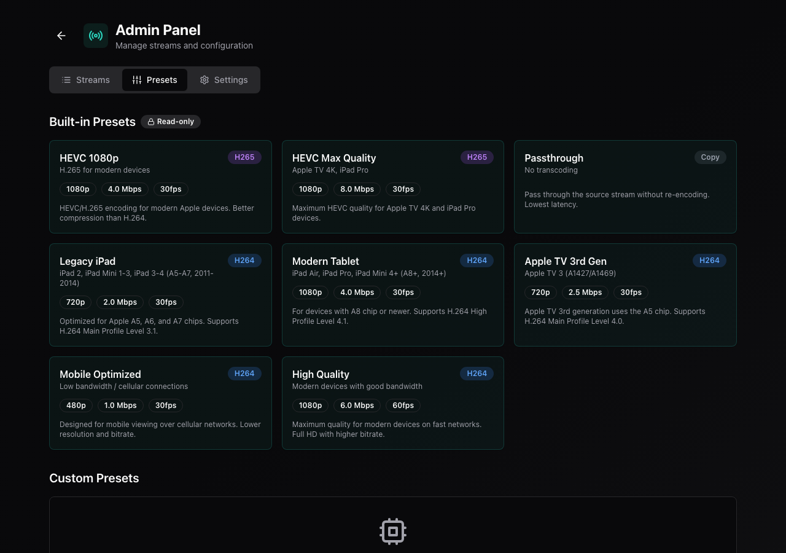
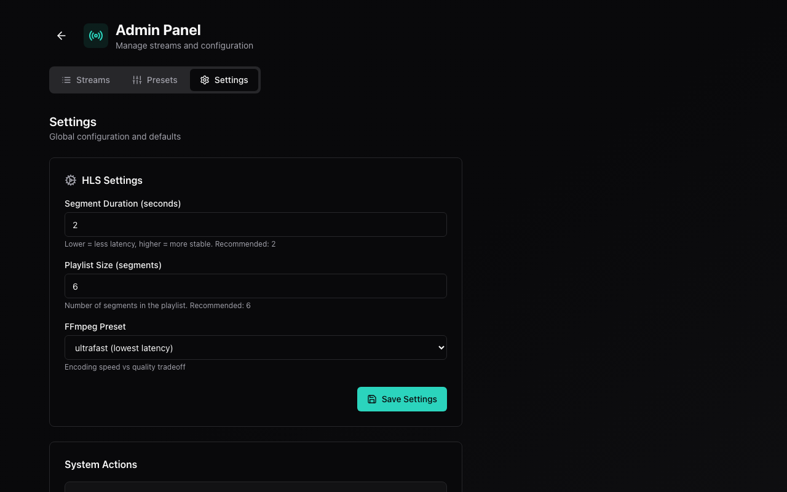

<div align="center">

# RelayStation


**Multi-source HLS relay with automatic failover, bandwidth-priority switching, and a real-time control dashboard**

[](https://go.dev/)
[](LICENSE)
[](https://www.docker.com/)
[](https://kit.svelte.dev/)
[](#-testing)

[](https://github.com/ParkWardRR/relaystation/releases)
[](https://github.com/ParkWardRR/relaystation/stargazers)
[](https://github.com/ParkWardRR/relaystation/pulls)

---

[Features](#-features) • [Relay](#-multi-source-relay) • [Quick Start](#-quick-start) • [Dashboard](#-relay-control-dashboard) • [API](#-api-endpoints)

</div>

<br>

<p align="center">
  
</p>

<br>

## ✨ Features

<table>
<tr>
<td width="50%">

### 📡 Multi-Source Relay
- **Automatic Failover** — if the active source dies, instantly switches to the next
- **Bandwidth Priority** — probes all sources, relays highest bitrate first
- **Zero Transcoding** — FFmpeg passthrough means zero quality loss + low CPU
- **Fast Switching** — switch sources via dashboard in ~200ms

</td>
<td width="50%">

### 🎛️ Control Dashboard
- **Real-time Monitoring** — live status, bandwidth, resolution, uptime
- **One-Click Switching** — switch between sources from the browser
- **Source Health** — green/red health indicators per source
- **VLC-Ready** — copy the stream URL and paste into VLC

</td>
</tr>
<tr>
<td width="50%">

### 🎬 Streaming Engine
- **Real-time HLS Transcoding** — H.264 & H.265/HEVC support
- **8 Built-in Presets** — Optimized for iPad, Apple TV, mobile
- **Passthrough Mode** — Zero-latency relay without transcoding
- **Source Probing** — Auto-detect upstream quality and variants

</td>
<td width="50%">

### 🔍 Stream Scanner
- **Web Page Scanner** — extract m3u8/MPD URLs from any web page
- **Iframe Detection** — finds embedded streams in iframes
- **Auto-Deduplication** — no duplicate sources
- **Label Detection** — extracts button labels near stream URLs

</td>
</tr>
<tr>
<td width="50%">

### ⚙️ Management
- **Stream Manager** — Add, edit, and toggle streams on the fly
- **Preset Editor** — Customize or create new encoding profiles
- **Hot Reload** — Apply changes without restarting
- **REST API** — Full programmatic control

</td>
<td width="50%">

### 🚀 Deployment
- **Single Docker Command** — Up and running in seconds
- **Multi-Platform** — macOS, Linux, DigitalOcean, and more
- **Nginx Ready** — SSL/TLS termination support
- **Systemd Integration** — Auto-start on boot

</td>
</tr>
</table>

<br>

## 📡 Multi-Source Relay

The relay accepts **multiple upstream m3u8 sources** and ensures continuous playback even when individual sources go down. On startup, it:

1. **Probes** all sources in parallel for bandwidth (from `EXT-X-STREAM-INF`)
2. **Sorts** them by max bandwidth (highest first)
3. **Checks health** of each source (HTTP liveness)
4. **Starts relaying** the highest-bandwidth healthy source via FFmpeg passthrough
5. **Monitors output** every 5 seconds; if stale for 15s → automatic failover

### How It Works

```
┌─────────────────────────────────────────────────┐
│              RelayStation Server                 │
│                                                 │
│  ┌──────────┐    ┌───────────┐    ┌──────────┐  │
│  │ Source 1  │──▶│           │──▶│  /hls/    │  │
│  │ 6.4 Mbps │   │  FFmpeg   │   │  stream   │  │──▶ VLC
│  └──────────┘   │ Passthru  │   │ .m3u8     │  │
│  ┌──────────┐   │ (active)  │   └──────────┘  │
│  │ Source 2  │   │           │                  │
│  │ 3.5 Mbps │   └───────────┘   ┌──────────┐  │
│  └──────────┘        ▲          │ Dashboard │  │──▶ Browser
│  ┌──────────┐        │          │  /relay   │  │
│  │ Source N  │ failover if      └──────────┘  │
│  │  (idle)  │ source dies                     │
│  └──────────┘                                 │
└─────────────────────────────────────────────────┘
```

### Key Design Decisions

| Decision | Rationale |
|----------|-----------|
| **FFmpeg passthrough** (`-c copy`) | Zero CPU overhead, zero quality loss |
| **Single active process** | Simpler, lower resource usage vs. multi-process |
| **Probe before sort** | ensures highest quality source is always first |
| **200ms switch time** | kill + cleanup + start is nearly instant |
| **30-segment buffer** | ~2 minutes of buffer absorbs brief upstream outages |
| **Background health checks** | every 30s probes ALL sources, not just active |

### Relay Configuration

Sources are configured in `cmd/relaystation/main.go`. The relay probes and re-orders them automatically:

```go
nascarRelay := relay.NewRelay(relay.Config{
    Sources: []relay.FeedSource{
        {URL: "https://cdn.example.com/stream1/master.m3u8", Label: "CDN-Primary"},
        {URL: "https://cdn.example.com/stream2/master.m3u8", Label: "CDN-Backup"},
        {URL: "https://backup.example.com/stream.m3u8",      Label: "Backup"},
    },
    OutputBase:     outputBase,   // HLS output directory
    OutputPath:     "relay/name", // path under OutputBase
    ListenAddr:     ":8080",
    MaxRestarts:    3,            // per-source restart limit before failover
    HLSSegmentTime: 4,           // seconds per segment
    HLSListSize:    30,          // segments in playlist (~2 min buffer)
})
```

<br>

## 🎛️ Relay Control Dashboard

Access the dashboard at **`http://YOUR_IP:8080/relay`**.

| Feature | Description |
|---------|-------------|
| **Active Source** | Shows which source is currently being relayed |
| **Bandwidth** | Max bandwidth of the active source (Mbps) |
| **Resolution** | Output resolution (e.g., 1920×1080) |
| **Health Indicators** | 🟢 Live / 🔴 Down per source |
| **One-Click Switch** | Click "Switch" to instantly change source |
| **VLC URL** | Copy-paste URL for VLC network stream |
| **Auto-Refresh** | Polls status every 2 seconds |

The dashboard is served as an embedded HTML page — no build step, no external dependencies.

<br>

## 🚀 Quick Start

```bash
# Clone the repository
git clone https://github.com/ParkWardRR/relaystation.git
cd relaystation

# Start with Docker Compose
docker compose -f docker/docker-compose.yml up -d

# Open your browser
open http://localhost:8080
```

### Run with Relay (Development)

```bash
# Install dependencies
brew install go ffmpeg

# Run the relay server
RELAYSTATION_CONFIG=./configs/streams.json \
RELAYSTATION_OUTPUT=/tmp/relaystation-hls \
RELAYSTATION_ADDR=:8080 \
go run ./cmd/relaystation

# Open the relay dashboard
open http://localhost:8080/relay

# Open in VLC
open -a VLC http://localhost:8080/hls/relay/nascar/stream.m3u8
```

<br>

## 📸 Screenshots

<details open>
<summary><strong>🎛️ Relay Dashboard</strong> — Real-time source control with one-click switching</summary>
<br>
<p align="center">
  
</p>
</details>

<details>
<summary><strong>🎛️ Live Dashboard</strong> — Real-time stream monitoring with built-in HLS player</summary>
<br>
<p align="center">
  
</p>
</details>

<details>
<summary><strong>📱 Mobile View</strong> — Fully responsive design for on-the-go monitoring</summary>
<br>
<p align="center">
  
</p>
</details>

<details>
<summary><strong>📡 Admin Panel - Streams</strong> — Manage all your streams in one place</summary>
<br>
<p align="center">
  
</p>
</details>

<details>
<summary><strong>🎨 Admin Panel - Presets</strong> — Customize transcoding profiles</summary>
<br>
<p align="center">
  
</p>
</details>

<details>
<summary><strong>⚙️ Admin Panel - Settings</strong> — Configure global defaults</summary>
<br>
<p align="center">
  
</p>
</details>

<br>

## 🛠️ Tech Stack

| Component | Technology |
|-----------|------------|
| **Backend** | Go 1.22 + [Fiber](https://gofiber.io/) |
| **Relay** | FFmpeg passthrough + multi-source failover |
| **Scanner** | Regex-based m3u8/MPD extractor |
| **Dashboard** | Embedded HTML/CSS/JS (no build step) |
| **Frontend** | [SvelteKit](https://kit.svelte.dev/) + [Tailwind CSS](https://tailwindcss.com/) + [shadcn-svelte](https://www.shadcn-svelte.com/) |
| **Video Player** | [HLS.js](https://github.com/video-dev/hls.js) |
| **Streaming** | [FFmpeg](https://ffmpeg.org/) (H.264/H.265) |
| **Deployment** | Docker + Docker Compose |

<br>

## 📦 Installation

Choose your platform below. Each includes both development and production setup.

<details>
<summary><strong>🍎 macOS + OrbStack</strong></summary>

### Prerequisites
- [OrbStack](https://orbstack.dev/) (or Docker Desktop)
- Git

### Development Setup
```bash
# Install dev tools via Homebrew
brew install go node ffmpeg

# Clone the repository
git clone https://github.com/ParkWardRR/relaystation.git
cd relaystation

# Install frontend dependencies
make web-install

# Run backend + frontend separately (hot reload)
make web-dev          # Terminal 1: Frontend dev server
make dev              # Terminal 2: Backend
```

### Production Setup
```bash
git clone https://github.com/ParkWardRR/relaystation.git
cd relaystation
docker compose -f docker/docker-compose.yml up -d
open http://localhost:8080
```

**Auto-start on login:** Create `~/Library/LaunchAgents/com.relaystation.plist` — see full docs below.

</details>

<details>
<summary><strong>🐧 AlmaLinux / RHEL</strong></summary>

### Prerequisites
```bash
sudo dnf update -y
sudo dnf config-manager --add-repo https://download.docker.com/linux/centos/docker-ce.repo
sudo dnf install -y docker-ce docker-ce-cli containerd.io docker-compose-plugin
sudo systemctl enable --now docker
sudo usermod -aG docker $USER
```

### Production Setup
```bash
git clone https://github.com/ParkWardRR/relaystation.git
cd relaystation
docker compose -f docker/docker-compose.yml up -d
sudo firewall-cmd --permanent --add-port=8080/tcp && sudo firewall-cmd --reload
```

**Auto-start with systemd:** Create `/etc/systemd/system/relaystation.service` — see full docs below.

</details>

<details>
<summary><strong>🌊 DigitalOcean Droplet</strong></summary>

### Create Droplet
1. **Image:** Docker on Ubuntu (Marketplace)
2. **Size:** Basic $6/mo (1 vCPU, 1GB) — or higher for multiple streams
3. **Region:** Choose closest to your users
4. **Auth:** SSH keys (recommended)

### Production Setup
```bash
ssh root@your-droplet-ip
git clone https://github.com/ParkWardRR/relaystation.git
cd relaystation
docker compose -f docker/docker-compose.yml up -d

# Configure firewall
ufw allow OpenSSH
ufw allow 8080/tcp
ufw enable
```

**Domain + SSL:** Install Nginx + Certbot — see full docs below.

</details>

<br>

## ⚙️ Configuration

Edit `configs/streams.json` to add your streams:

```json
{
  "streams": [
    {
      "id": "my-stream",
      "name": "My Stream",
      "upstream": "https://example.com/stream.m3u8",
      "enabled": true,
      "profiles": {
        "high_quality": {
          "enabled": true
        }
      }
    }
  ]
}
```

### Environment Variables

| Variable | Default | Description |
|----------|---------|-------------|
| `RELAYSTATION_CONFIG` | `/etc/relaystation/streams.json` | Path to stream configuration |
| `RELAYSTATION_OUTPUT` | `/var/www/hls` | Directory for HLS segments |
| `RELAYSTATION_STATIC` | `./web/build` | Path to SvelteKit build |
| `RELAYSTATION_ADDR` | `:8080` | HTTP server listen address |

<br>

## 🎨 Built-in Presets

| Preset | Codec | Resolution | Bitrate | Use Case |
|--------|-------|------------|---------|----------|
| **HEVC 1080p** | H.265 | 1920×1080 | 4.0 Mbps | Modern Apple devices |
| **HEVC Max Quality** | H.265 | 1920×1080 | 8.0 Mbps | Apple TV 4K, iPad Pro |
| **Legacy iPad** | H.264 | 1280×720 | 2.0 Mbps | iPad 2, iPad Mini 1-3 |
| **Modern Tablet** | H.264 | 1920×1080 | 4.0 Mbps | iPad Air, iPad Pro |
| **Apple TV 3rd Gen** | H.264 | 1280×720 | 2.5 Mbps | Apple TV 3 |
| **Mobile Optimized** | H.264 | 854×480 | 1.0 Mbps | Cellular / low bandwidth |
| **High Quality** | H.264 | 1920×1080 | 6.0 Mbps | Fast networks |
| **Passthrough** | Copy | — | — | Lowest latency |

<br>

## 🔌 API Endpoints

### Stream Management

| Endpoint | Method | Description |
|----------|--------|-------------|
| `/api/status` | GET | Server and stream status |
| `/api/streams` | GET/POST | List or create streams |
| `/api/streams/:id` | GET/PUT/DELETE | Manage a stream |
| `/api/streams/:id/source-info` | GET | Probe upstream source |
| `/api/presets` | GET/POST | List or create presets |
| `/api/presets/:id` | DELETE | Delete custom preset |
| `/api/defaults` | GET/PUT | Global default settings |
| `/api/reload` | POST | Hot-reload configuration |
| `/ws/events` | WebSocket | Real-time status updates |

### Relay Control

| Endpoint | Method | Description |
|----------|--------|-------------|
| `/relay` | GET | Relay control dashboard (HTML) |
| `/api/relay/status` | GET | Relay status, sources, health, bandwidth |
| `/api/relay/switch/:idx` | POST | Switch to source by index (instant) |
| `/api/relay/scan` | POST | Scan web pages for stream URLs |
| `/hls/relay/nascar/stream.m3u8` | GET | Output HLS stream for VLC |

#### Example: Switch Source

```bash
# Switch to source index 2
curl -X POST http://localhost:8080/api/relay/switch/2

# Response: {"ok": true, "switched_to": 2}
```

#### Example: Get Relay Status

```bash
curl http://localhost:8080/api/relay/status | python3 -m json.tool
```

```json
{
  "running": true,
  "active_source": {
    "url": "https://cdn.example.com/master.m3u8",
    "label": "CDN-Primary",
    "max_bandwidth": 6388800,
    "max_resolution": "1280x720",
    "healthy": true
  },
  "active_idx": 0,
  "all_sources": [...],
  "restart_count": 0,
  "failover_count": 0,
  "uptime": "5m30s"
}
```

#### Example: Scan for Streams

```bash
curl -X POST http://localhost:8080/api/relay/scan \
  -H "Content-Type: application/json" \
  -d '{"urls": ["https://example.com/streams-page"]}'
```

<br>

## 🧪 Testing

```bash
# Run all tests
go test ./... -v

# Run relay tests only
go test ./internal/relay/... -v

# Run scanner tests only
go test ./internal/scanner/... -v

# Run with coverage
go test ./... -cover
```

Tests cover:
- **Relay**: creation, defaults, buffer config, output URL, status, liveness checks, output freshness, segment cleanup, failover logic, source health, switch validation, bandwidth probing, sorting
- **Scanner**: m3u8 extraction, MPD extraction, deduplication, error handling, page simulation, URL cleaning

<br>

## 🧑‍💻 Development

```bash
make build        # Build Go binary
make dev          # Run in development mode
make test         # Run tests
make clean        # Clean build artifacts
make docker       # Build Docker image
make docker-up    # Start with Docker Compose
make docker-down  # Stop Docker Compose
make web-install  # Install web dependencies
make web-build    # Build web frontend
make web-dev      # Run web dev server
make all          # Full build (web + docker)
```

<br>

## 📁 Architecture

```
relaystation/
├── cmd/relaystation/          # Go entry point
├── internal/
│   ├── api/                   # REST API + Fiber router
│   │   └── handlers/          # HTTP handlers (stream, relay, presets, status)
│   ├── config/                # Configuration & presets
│   ├── ffmpeg/                # FFmpeg process management
│   ├── models/                # Data types
│   ├── relay/                 # ⚡ Multi-source relay engine
│   │   ├── relay.go           #   Core relay (failover, switching, FFmpeg)
│   │   └── relay_test.go      #   Comprehensive test suite
│   ├── scanner/               # 🔍 Stream URL scanner
│   │   ├── scanner.go         #   m3u8/MPD extraction from web pages
│   │   └── scanner_test.go    #   Scanner tests
│   └── stream/                # Stream manager
├── web/                       # SvelteKit frontend
│   ├── src/
│   │   ├── lib/               # Components & stores
│   │   └── routes/            # Pages
│   └── package.json
├── docker/                    # Docker configuration
├── configs/                   # Stream configuration
└── screenshots/               # Documentation images
```

<br>

## 📄 License

This project is licensed under the [Blue Oak Model License 1.0.0](LICENSE).

<br>

---

<div align="center">

**[⬆ Back to Top](#relaystation)**

<br>

<sub>Built for streaming flexibility</sub>

</div>
